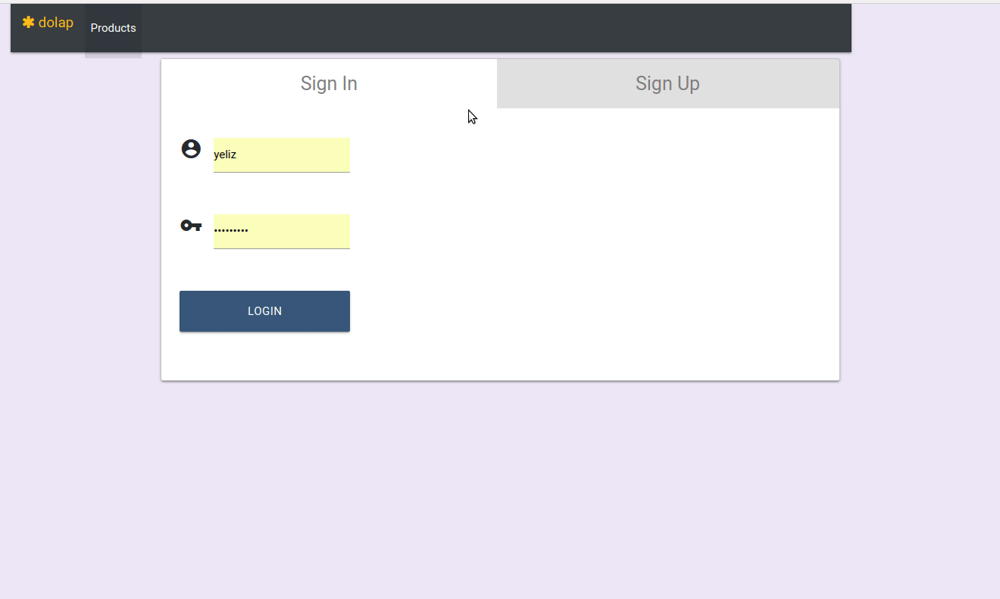

# SpringBoot-Redis-App

SpringBoot-Redis-App is an e-commerce application. :computer:

Front-end repository : https://github.com/yeliztaneroglu/Angular-App

:chart_with_upwards_trend: Unit tests were applied in the project.

### Requirements :mag_right:

- [x] Apache Maven plugins
- [x] org.projectlombok 
- [x] Java
- [x] Spring Boot
- [x] Test frameworks (JUnit, Mockito, AssertJ)
- [x] Thymeleaf / Angular
- [x] PostgreSQL
- [x] Redis

 ### How to compile SpringBoot-Redis-App project ?  :memo:

It should be quite straightforward to run your application from an IDE with some maven support (Eclipse, IntellIJ). These IDE's will take care about creating the correct classpath.

If you want to do this manually, try this:

change to the directory that contains the pom.xml execute the maven command:

:pushpin: `mvn clean install`

